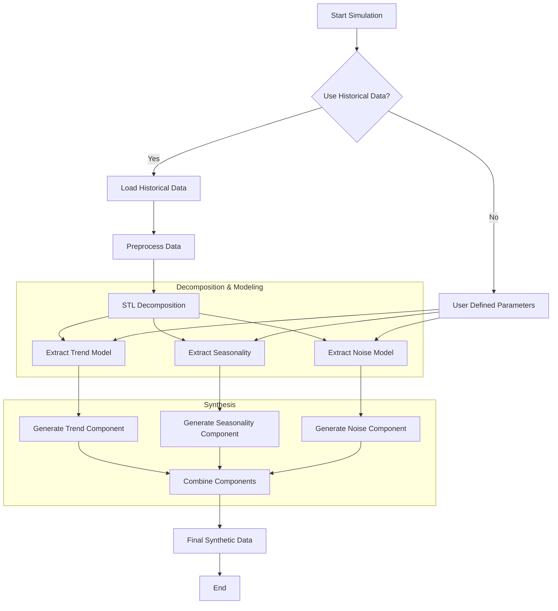

# Data Generation Flow

This diagram illustrates the process of generating synthetic sensor data in the BISTEP simulator.

## Component Details

1.  **Trend ($T_t$)**: Modeled using Polynomial Regression (Degree 1 or 2).
2.  **Seasonality ($S_t$)**:
    *   **Yearly**: Average pattern over a year.
    *   **Daily**: Average pattern over a day.
3.  **Noise ($R_t$)**: Modeled using AutoRegressive (AR) models or Gaussian Noise.

## Formula

$$ Y_{new}(t) = T_{poly}(t) + S_{yearly}(t) + S_{daily}(t) + \text{Noise}_{AR}(t) $$
